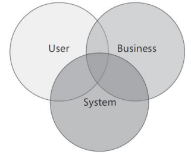

# VideoFlix

## Exercise 1
The objective of the first architecture iteration is to build a prototype of the 
system.

Identify some key scenarios from the perspective of:

### User
* Creating a user
* Login - (WITH OUAH2)
* Logout
* Stream media one at time
* Search by category
* Search by movie names
* Change profile (etc.) 
* Shall receive video recommendations
* Paying a bill over site
* Subscribe to site
* Multiple  sub profiles for some account

### Business
* Billing
* Subscribtion a user
* Ads 
* Add Media to site
* Remove Media from site 

### The system
* Decypting password
* Contains media
* Handle streaming for mutilple users

## Exercise 2
Decide which key scenarios you will address in this iteration. Why did you decide on these scenarios?

## Exercise 3
Based on the key scenarios you have chosen, identify quality attributes you find it relevant to address in the prototype.

## Exercise 4
Quantify the quality attributes you have found. (I.e. what does it actually mean to have “high accessibility”, etc.?)
How do you plan to test that you live up to the quality attributes you have defined?

## Exercise 5
Create an application overview for the prototype.

## Exercise 6
Identify key issues you have to address. Where are you most likely to make mistakes or run into problems?

## Exercise 7
Define a candidate solution, i.e. create the architecture for the prototype.

## Exercise 8 
Which architecture objectives would you consider for the next iteration?
